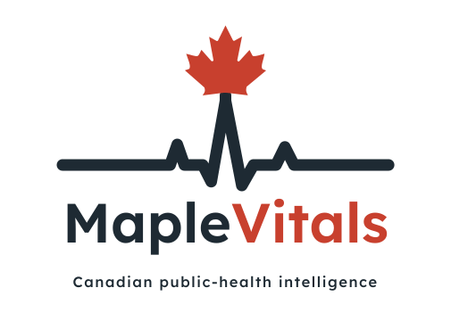

<picture>
  <source media="(prefers-color-scheme: dark)" srcset="logo/maplevitals-lockup-dark.svg">
  
</picture>

Ask MapleVitals a question about Canadian public-health data in plain English —
e.g. *"How has diabetes prevalence changed by province since 2015?"* — and it
figures out the analysis, runs it, and returns a chart with a short interpretation
grounded in the real source.

> **Status:** ✅ Live Streamlit app with verified agent outputs, interactive charts, and a province-level choropleth map. Agentic live querying, RAG grounding, and multi-turn memory are on the roadmap below.

## Showcase

- Fair/poor mental health by age & gender in Alberta (2015–2024)
- Heavy drinking trends in Alberta among 18–34 year olds
- Smoking rates among young adults
- Self-reported obesity ranked by province (2024)
- Healthcare access vs. self-rated health in Alberta

## Roadmap

- [x] **M0** — Load a Canadian health CSV, get an LLM to describe it
- [x] **M1** — Plain-English question → agent writes & runs analysis → chart + interpretation
- [x] **M2** — Streamlit UI with dark/light theme, choropleth map, and data-quality flags
- [ ] **M3** — RAG grounding with citations (ChromaDB)
- [ ] **M4** — Agent fetches its own data live via the StatCan API (LangGraph)
- [ ] **M5** — Persistence + multi-turn memory (SQL)
- [ ] **M6** — Deploy (FastAPI + Docker, live link)

## Setup

```bash
conda create -n maplevitals python=3.12 -y
conda activate maplevitals
pip install streamlit plotly pandas
```

Then run:
```bash
streamlit run app.py
```

## Data

Uses StatCan table **13-10-0096** — "Health characteristics, annual estimates."
Download the CSV from statcan.gc.ca and place it at `data/health.csv`.

## Tech

Python · Pandas · Plotly · Streamlit
